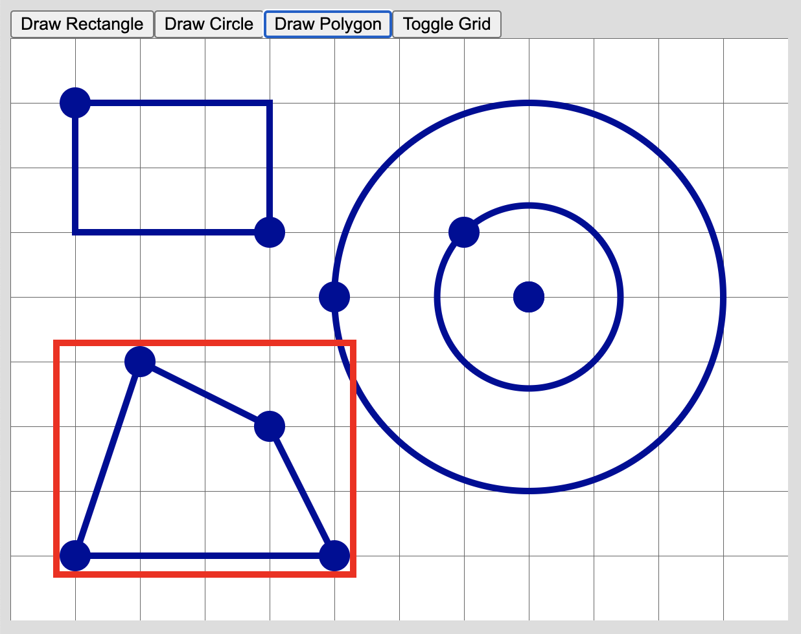

# svg-live-drawing

[![NPM package][npm]][npm-url]

*This project was discontinued in favor of [daign-2d-graphics](https://github.com/daign/daign-2d-graphics)!*

Library for interactive SVG drawing applications.

## Installation

```sh
npm install svg-live-drawing --save
```

## Demo

[Online demo can be found here.][examples-url]



## Scripts

#### Build

    npm run build

#### Run lint analysis

    npm run lint

#### Run unit tests with code coverage

    npm run test

[npm]: https://img.shields.io/npm/v/svg-live-drawing.svg
[npm-url]: https://www.npmjs.com/package/svg-live-drawing
[examples-url]: https://github.com/convivo-gmbh/svg-live-drawing-examples
